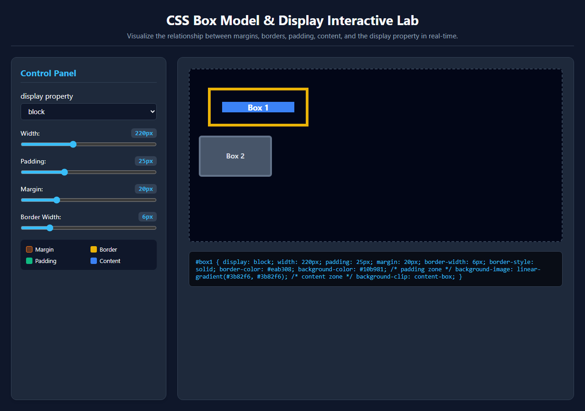
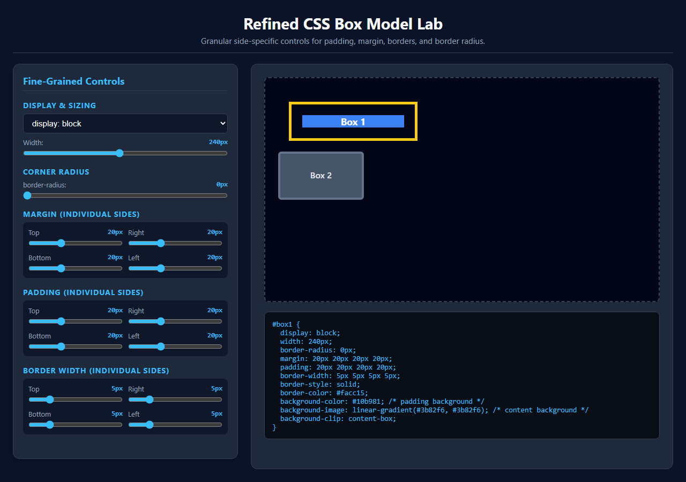
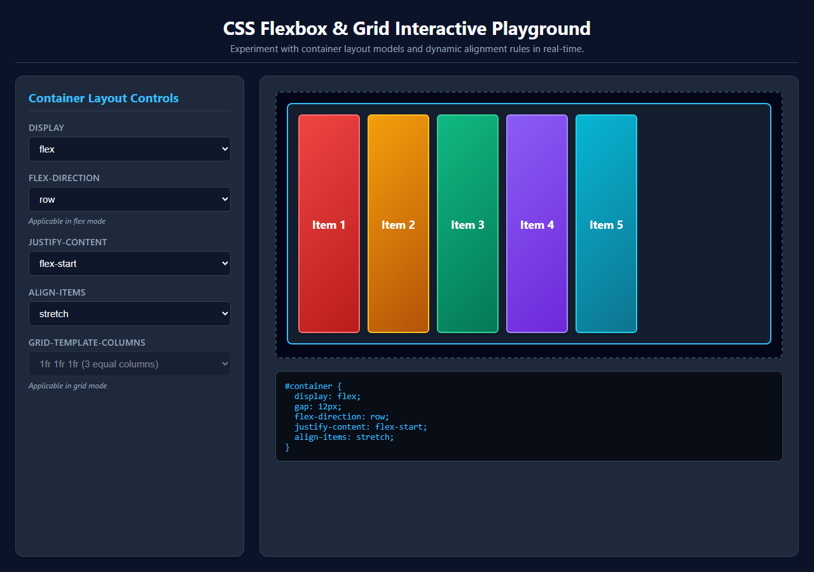

# Yonas_AI: Dynamic Web Lab Generation for Core CSS Concepts

**Author**: Yonas Leykun  
**Institution**: Frontier Institute of Technology (SET)  
**Course**: SE 203 / SE 300: High Level Programming & Artificial Intelligence in Software Engineering  
**Module**: W3 | Web Static & AI Interactive Labs  
**AI Tool Used**: Gemini with Canvas / Antigravity Agentic Assistant  

---

## 1. Full Prompt Texts

### Prompt 1: Initial Box Model Lab (Box Model & Display)
```text
Act as a frontend web developer. Using your Canvas tool, Generate an interactive website that can be used for understanding the CSS Box Model and its relationship with the display property.

The page must have:

1. Two div elements, 'Box 1' and 'Box 2', so I can see how they interact. 'Box 1' will be the one we control.
2. The CSS must use different background colors for the content area, the padding area, and the margin area of 'Box 1' (e.g., using background-clip: content-box). The border should be a solid line.
3. A control panel with:
- Sliders to control the padding, margin, border-width, and width of 'Box 1'.
- Labels next to the sliders that show the current pixel value.
- A Dropdown (select) to change the display property of 'Box 1' to: block, inline-block, and inline.
4. JavaScript that listens to all sliders and the dropdown, and updates the CSS properties of 'Box 1' in real-time.
```

### Prompt 2: Refinement Prompt (Side-Specific Controls & Corner Radius)
```text
Implement sliders to adjust the margin, padding, and border for each side (top, right, bottom, left) individually, and add a separate slider for the corner radius.
```

### Prompt 3: Flexbox and Grid Playground Generation
```text
Act as a frontend web developer. Using your Canvas tool, generate an interactive website that can be used as a playground for CSS Flexbox and Grid.

The page should have:

1. A `div` element acting as the container.
2. Several `div` elements inside acting as the items (e.g., 5 items).
3. Dropdown menus (selects) that allow me to change the CSS properties of the container.
4. I need to be able to change:
- display (to switch between block, flex, and grid)
- flex-direction (row, column)
- justify-content (flex-start, center, space-between, etc.)
- align-items (flex-start, center, stretch, etc.)
- grid-template-columns (e.g., 1fr 1fr, 1fr 1fr 1fr)
5. The JavaScript must update the container's CSS in real-time when I change a dropdown.
```

---

## 2. Execution Screenshots

### Screenshot 1: Initial Box Model Lab
  
*Figure 1: Initial Box Model Lab showing Box 1 and Box 2 with display, width, padding, margin, and border controls.*

### Screenshot 2: Refined Box Model Lab (Side-Specific Controls & Corner Radius)
  
*Figure 2: Refined Box Model Lab featuring individual top, right, bottom, left sliders and corner radius.*

### Screenshot 3: Flexbox and Grid Playground
  
*Figure 3: Flexbox & Grid Playground demonstrating dynamic container layout property switching and alignment.*

---

## 3. Reflection and Synthesis

### Learning Efficacy: Interactive Visual Feedback vs. Static Documentation
Traditional methods of learning CSS architecture rely predominantly on static documentation and fixed diagrams. While standard box model diagrams illustrate theoretical boundary layers—margin, border, padding, and content—they obscure the dynamic runtime constraints that govern real-world layouts. In contrast, instantly generating and interacting with dynamic web labs creates a tight sensory feedback loop that dramatically accelerates comprehension. The utility of this experiential learning is particularly evident when toggling the `display` property to `inline`. In static texts, the explanation that inline non-replaced elements ignore explicit `width` declarations and vertical margins in document flow can feel abstract and counterintuitive. Within the interactive lab, the moment `display: inline` is selected, the learner immediately witnesses Box 1 collapse horizontally to hug its text content, completely disregarding the width slider. Furthermore, adjusting vertical margins leaves adjacent elements unmoved vertically, while Box 2 immediately shifts onto the same horizontal line. This real-time visual causality converts complex specification rules into an intuitive, indelible mental model.

### AI Workflow: Agile Incremental Refinement vs. Monolithic Prompting
Utilizing a sequential refinement prompt strategy—first generating a stable, functional baseline Box Model lab before requesting granular side-specific controls—demonstrates a profound engineering advantage over monolithic "one-shot" prompting. In the initial prompt, the AI focused on fundamental architectural concerns: structuring clean HTML semantic containers, establishing responsive two-column grid ergonomics, applying `background-clip: content-box` for visual layering, and wiring up core state management listeners. The subsequent refinement prompt then isolated a specific dimension of complexity: breaking single scalar inputs into quad-directional properties (`top`, `right`, `bottom`, `left`) and adding `border-radius` calculations. This iterative prompting pattern directly mirrors agile software engineering methodologies, where teams establish a working Minimum Viable Product (MVP), validate core behaviors, and incrementally refactor. Attempting to specify every granular slider, color band, and layout contingency in a single massive prompt introduces severe cognitive load on the language model, frequently triggering missed requirements, malformed layout CSS, or dropped event listeners. Phased iteration ensures architectural robustness and deterministic code quality.

---

## 4. GitHub Repository Update

All source files, interactive single-file HTML applications, task documentation, and high-resolution screenshots have been organized and committed within the project repository:
- **GitHub Repository**: [SET-higher_level_programming](https://github.com/yonasleykun27/SET-higher_level_programming)
- **Task Folder**: [`AI_Dynamic_Web_Lab_Generation_for_Core_CSS_Concepts`](https://github.com/yonasleykun27/SET-higher_level_programming/tree/main/AI_Dynamic_Web_Lab_Generation_for_Core_CSS_Concepts)
